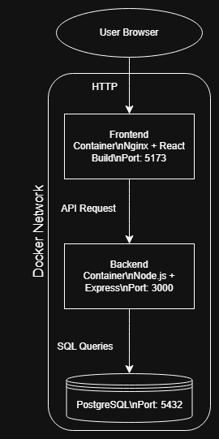

<br />
<div align="center">
  <h2 align="center">Task Manager App</h2>

  <p align="center">
    Web application full-stack minimal per la gestione di task con autenticazione utenti.
    Il progetto è completamente containerizzato tramite Docker Compose ed è pensato per essere eseguibile su qualsiasi macchina senza configurazioni manuali complesse.
  </p>
</div>

# Progetto
Applicazione web minimale che permette la gestione di task personali tramite autenticazione JWT.

Gli utenti possono registrarsi, effettuare login e gestire le proprie task in modo isolato.

---

## 1. Funzionalità

- Registrazione e login utenti
- Autenticazione tramite JWT
- Creazione, modifica e cancellazione task
- Associazione task → utente
- Visualizzazione task personali
- Persistenza dati su PostgreSQL
- Architettura containerizzata

---

## 2. Architettura del progetto

L'applicazione segue una 3-tier architecture:
- **frontend** -> React (Vite) servito tramite Nginx
- **backend** -> Node.js + Express (API REST)
- **db** -> PostgreSQL

La comunicazione avviene tramite API REST tra frontend e backend, mentre il backend si occupa di comunicare con il database.

# Diagramma Architetturale



---

## 3. Database
Il database viene inizializzato automaticamente tramite Docker:

Tabelle presenti: 
- users
- tasks

Relazione: 
- un utente può avere più task (1 -> N)

---

## 4. Scelte progettuali
- **React + Vite** → UI moderna e build veloce
- **Node.js + Express** → API REST leggere e modulari
- **PostgreSQL** → database relazionale affidabile
- **JWT** → autenticazione stateless
- **Docker Compose** → portabilità totale del progetto
- **Nginx** → serving della build frontend

---

## 5. Prerequisiti

Per eseguire il progetto è necessario aver installato:
- Docker Desktop
- Git

---

## 6. Avvio del progetto con Docker 

### 1. Clona il repository

```bash
git clone https://github.com/alygorithm/task-manager-app.git
cd task-manager-app
```

### Configurare ambiente

Copia il file di esempio:

```bash
cp .env.example .env
```

Il file `.env` deve contenere:

```env
PORT=3000

DB_HOST=db
DB_PORT=5432
DB_USER=postgres
DB_PASSWORD=postgres
DB_NAME=taskdb

JWT_SECRET=change_me
```

JWT_SECRET rappresenta la chiave utilizzata per firmare i token JWT.  
Nel contesto di sviluppo locale può essere qualsiasi stringa.

---

### Avvio dei container

```bash
docker compose up --build
```

### Servizi disponibili
- Frontend → http://localhost:5173
- Backend → http://localhost:3000

### Reset ambiente (opzionale)

Per eliminare del tutto il database e ripartire da zero:

```bash
docker compose down -v
```

## 7. Avvio in locale (senza Docker)

Questa modalità è solo per sviluppo avanzato e non è la modalità principale del progetto.

Il progetto è pensato principalmente per essere eseguito tramite Docker Compose.

L’avvio manuale è possibile ma richiede una configurazione aggiuntiva.

### Requisiti aggiuntivi
- Node.js 18+
- PostgreSQL installato ed in esecuzione localmente
- Database `taskdb` già creato

### Configurazione backend

Nel file `.env` locale modificare:

```env
DB_HOST=127.0.0.1
```

### Avvio backend

```bash
cd backend
npm install
npm run dev
```

### Avvio frontend 

```bash
cd frontend
npm install
npm run dev
```

In modalità manuale il database e le relative tabelle devono essere inizializzati manualmente tramite lo script `init.sql`


# 📦 Inventory Tracker

Applicazione web full-stack per la gestione multi-utente di un inventario, con monitoraggio delle scorte in tempo reale.

## 🚀 Funzionalità Principali
- **Autenticazione Sicura**: Registrazione e login con crittografia password (bcrypt) e token JWT.
- **Isolamento Dati**: Ogni utente visualizza e gestisce esclusivamente il proprio inventario (Multi-tenancy).
- **Dashboard Intelligente**: Metriche in tempo reale su totale oggetti e alert automatici per le scorte basse.
- **CRUD Completo**: Creazione, lettura, modifica ed eliminazione degli articoli con barra di ricerca istantanea.
- **Containerizzazione**: Ambiente di sviluppo e produzione riproducibile al 100% tramite Docker Compose.
- **CI/CD**: Pipeline automatizzata con GitHub Actions per il controllo di qualità e la build a ogni push.

## 🛠️ Stack Tecnologico
| Livello | Tecnologia |
|---------|------------|
| **Frontend** | React 19, Vite, Axios, CSS inline |
| **Backend** | Node.js 20, Express, JWT, bcrypt |
| **Database** | PostgreSQL 16 |
| **DevOps** | Docker, Docker Compose, GitHub Actions |

## ▶️ Avvio Locale
Assicurati di avere Docker Desktop installato e in esecuzione.

```bash
# 1. Clona il repository
git clone https://github.com/TUO_USERNAME/inventory-tracker.git
cd inventory-tracker

# 2. Avvia tutti i servizi (Frontend, Backend, Database)
docker compose up --build
